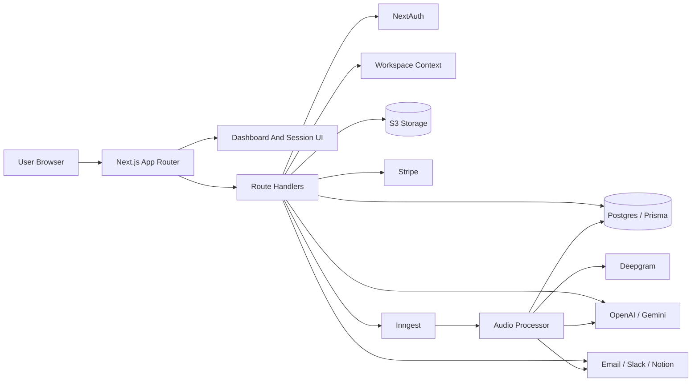

# Voxly Interview Prep

## One-Sentence Summary

Voxly is a production-oriented Next.js 16 transcription workspace that turns uploaded recordings into structured transcripts, AI summaries, grounded project/workspace intelligence, collaborative tasks/comments, recurring reports, and Stripe-metered credit usage.

## External Services Count

The app currently uses **9 external runtime services/integrations**:

| # | Service | Purpose | Evidence in code |
| --- | --- | --- | --- |
| 1 | PostgreSQL provider | Relational database behind Prisma | `prisma/schema.prisma` uses `provider = "postgresql"` and `DATABASE_URL` |
| 2 | AWS S3 or S3-compatible storage | Audio/video object storage and signed file access | `lib/storage/s3.js` |
| 3 | Deepgram | Speech-to-text transcription | `lib/deepgram.js` |
| 4 | OpenAI | LLM summarization, formatting, chat, intelligence | `lib/llm/openai.js` |
| 5 | Google Gemini | Alternate/fallback LLM provider | `lib/llm/gemini.js` |
| 6 | Stripe | Checkout, subscriptions, top-ups, portal, webhooks | `lib/billing.ts`, `app/api/stripe/webhook/route.ts` |
| 7 | Inngest | Background audio-processing jobs | `inngest/functions.ts` |
| 8 | Resend | Email delivery for verification, session-ready, and digest emails | `lib/email.ts` |
| 9 | Slack | Digest delivery and insight sharing through incoming webhooks | `lib/slack.ts` |

There is also **1 optional user-configured integration**:

| Service | Purpose | Evidence in code |
| --- | --- | --- |
| Notion | Publish saved insights to a configured Notion page | `lib/notion.ts` |

Deployment and scheduling can add more infrastructure services depending on where the app is hosted. The repo includes support/docs for AWS, Terraform, GitHub Actions, Docker, GCP Terraform examples, and protected cron endpoints that could be called by AWS EventBridge Scheduler, but those are deployment choices rather than mandatory runtime integrations.

## Elevator Pitch

Use this when someone asks, "What did you build?"

> I built Voxly as a full-stack AI workspace for recordings. Users can sign up, verify email, upload audio or video into a workspace/project, store the media in S3, transcribe it with Deepgram, summarize it with OpenAI or Gemini, chat over the result, ask grounded questions across projects, save insights, track action items, collaborate through comments and notifications, and deliver recurring reports through email and Slack. I also built Stripe subscriptions, credit top-ups, promo codes, webhook idempotency, admin controls, and deployment runbooks for AWS-style production readiness.

## What Problem It Solves

Teams generate useful information in meetings, interviews, voice memos, calls, and project discussions, but that information often disappears into recordings or unstructured notes. Voxly turns those recordings into searchable, structured, collaborative knowledge:

- Transcripts become readable, searchable records.
- Key decisions, action items, next steps, and key points become structured data.
- Recordings can be grouped by workspace and project.
- Users can ask evidence-grounded questions across a project or workspace.
- Follow-ups become trackable tasks.
- Recurring reports keep teams updated without manually re-reading every transcript.

## Current Core Stack

| Area | Technology |
| --- | --- |
| App framework | Next.js 16 App Router |
| UI | React 19, Tailwind CSS 4 |
| API | Next.js route handlers under `app/api` |
| Auth | NextAuth credentials provider, Prisma adapter, bcrypt |
| Database | PostgreSQL through Prisma 6 |
| Async jobs | Inngest |
| File storage | S3-compatible object storage |
| Speech-to-text | Deepgram |
| LLMs | OpenAI and Gemini behind a provider abstraction |
| Billing | Stripe Checkout, Billing Portal, subscriptions, webhooks |
| Validation | Zod |
| Infrastructure | Docker, AWS docs, Terraform examples, GitHub Actions docs |

## Product Surface

### User-facing flows

- Email/password signup.
- Email verification.
- Sign-in through NextAuth credentials.
- Workspace selection and personal workspace creation.
- Project organization.
- Audio/video upload.
- Transcription processing.
- Structured summaries.
- Session detail view.
- Assistant chat over a transcript summary.
- Project-level intelligence Q&A.
- Workspace-level intelligence Q&A.
- Saved insights with cited sources.
- Action task tracking.
- Comments on transcripts, tasks, and insights.
- In-app notifications.
- Billing page with subscription and top-up options.
- Promo code redemption.
- Delivery settings for Slack, Notion, and digests.
- Operations/history surfaces for recurring report runs.

### Admin/operator flows

- Promotion code management.
- Stripe webhook processing and replay-safe idempotency.
- Migration and launch runbooks.
- AWS and Terraform deployment documentation.
- Report run summary for delivery observability.

## Architecture In Plain English

The application is a full-stack monolith with clear internal boundaries:

- `app/` contains pages and API route handlers.
- `lib/` contains the reusable domain logic.
- `prisma/` owns the data model and migrations.
- `inngest/` owns background job definitions.
- `docs/` and deployment runbooks document production operations.

The design keeps the product simple to deploy and iterate on while still isolating heavy or risky work behind domain modules: billing is in `lib/billing.ts`, workspace scoping is in `lib/workspaces.ts`, processing is in `lib/transcriptions/process.ts`, LLM provider selection is in `lib/llm/agent.js`, and reporting is in `lib/workspace-digests.ts`, `lib/project-digests.ts`, and `lib/report-runs.ts`.

## Key Files To Know Cold

| File | Why it matters |
| --- | --- |
| `prisma/schema.prisma` | Source of truth for users, workspaces, projects, transcriptions, insights, tasks, comments, billing, and reports |
| `lib/auth.ts` | NextAuth credentials configuration and email-verification login guard |
| `lib/workspaces.ts` | Active workspace resolution, personal workspace creation, membership checks, role helpers, default project creation |
| `app/api/uploads/route.ts` | Upload validation, S3 handoff, transcription record creation, Inngest enqueue |
| `lib/transcriptions/process.ts` | Main Deepgram + LLM processing pipeline and credit refund behavior |
| `inngest/functions.ts` | Background function for processing uploaded audio and sending ready emails |
| `lib/llm/agent.js` | OpenAI/Gemini provider abstraction and fallback order |
| `lib/intelligence/project-intelligence.ts` | Context chunking and grounded prompt construction for project/workspace Q&A |
| `app/api/intelligence/project/route.ts` | Project intelligence route with workspace scoping and source citations |
| `app/api/assistant/chat/route.ts` | Transcript-grounded assistant chat persistence |
| `lib/billing.ts` | Stripe plans, subscriptions, credit ledger, top-ups, promo redemption, webhook idempotency helpers |
| `app/api/stripe/webhook/route.ts` | Signed Stripe webhook handling |
| `lib/api/security.ts` | Same-origin checks, rate limits, request fingerprints |
| `lib/api/validation.ts` | Zod schemas for the API surface |
| `lib/workspace-digests.ts` | Workspace recurring report settings, scheduling, delivery payloads |
| `lib/project-digests.ts` | Project recurring report settings and delivery payloads |
| `lib/report-runs.ts` | Report run creation, filtering, and operational summaries |

## Domain Model Talking Points

### `User`

Stores identity, email verification, password hash, NextAuth relations, billing, templates, assistant messages, tasks, workspace membership, insights, notifications, and report templates.

Strong interview point:

> User identity is separate from workspace membership, which lets the same user belong to multiple workspaces and keeps collaboration permissions explicit.

### `Workspace`

The collaboration boundary. It owns members, invites, projects, transcriptions, comments, notifications, audit logs, insights, digest settings, Slack destinations, Notion settings, and recurring report runs.

Strong interview point:

> I made workspaces the tenant boundary so features like comments, notifications, insights, and delivery settings all have a consistent scope.

### `Project`

Groups transcriptions within a workspace and owns project-level insights, digest settings, and report runs.

Strong interview point:

> Projects let intelligence queries stay focused. Instead of asking over the entire workspace every time, users can ask grounded questions within a specific body of recordings.

### `Transcription`

Stores upload metadata, S3 key, template selection, processing status, transcript text, raw/formatted transcript variants, structured summary JSON, duration, and search text.

Strong interview point:

> I kept raw transcript, readable transcript, structured summaries, and search text separate because each serves a different product need: auditability, UI readability, structured rendering, and search/retrieval.

### `ActionTask`

Turns extracted action items into durable task records with status, priority, assignee, due date, source index, completion time, and comments.

### `ProjectInsight` and `WorkspaceInsight`

Persist AI answers with question, answer, confidence note, source citations, pinned/archive state, and comments.

Strong interview point:

> Saved insights are not just generated text. They store the question and source evidence so users can audit where the answer came from.

### `Subscription` and `CreditTransaction`

`Subscription` stores the current plan and balances. `CreditTransaction` stores the immutable ledger of refills, top-ups, usage, refunds, and webhook-linked changes.

Strong interview point:

> I separated current balance from ledger history because credit systems need both fast enforcement and auditable events.

### `RecurringReportRun`

Records each manual or scheduled digest run, including scope, trigger, cadence, report type, delivery channels, recipient counts, Slack delivery status, status, summary, metadata, and timestamp.

## Main Upload-To-Insight Workflow

1. The user uploads a media file from the dashboard.
2. `app/api/uploads/route.ts` enforces same-origin, rate limits, workspace auth, file size, MIME type, and credit availability.
3. The route resolves the selected summary template and selected project.
4. If no project is selected, the app ensures a default workspace project exists.
5. A `Transcription` row is created with status `uploading`.
6. The file is uploaded to S3 under a user-scoped key.
7. The `Transcription` row is updated to status `uploaded`.
8. The route sends `voxly/audio.uploaded` to Inngest.
9. `inngest/functions.ts` runs `processUploadedAudio`.
10. The processor marks the transcription as `processing`.
11. It creates a signed S3 URL.
12. It sends the recording to Deepgram.
13. It extracts raw transcript, readable transcript, and duration.
14. It optionally asks the LLM to improve transcript formatting.
15. It asks the LLM to create structured summary sections.
16. It applies usage credits based on rounded-up recording duration.
17. It persists transcript text, structured summary, search text, duration, and status `done`.
18. Inngest sends a session-ready email unless it reused an existing processed result.

Failure behavior:

- Upload failures clean up uploaded S3 objects when possible.
- Enqueue failures mark the transcription `error`.
- Processing failures refund usage credits and mark the transcription `error`.
- Previously completed processing can be reused to avoid duplicate processing and duplicate notification emails.

## Authentication And Workspace Flow

1. A user signs up through the app.
2. The signup route validates the request, hashes the password, creates the user, and sends verification.
3. NextAuth credentials login checks email/password and rejects users without `emailVerified`.
4. `getWorkspaceContext` loads the authenticated user.
5. `ensurePersonalWorkspaceForUser` creates or repairs the personal workspace and owner membership.
6. `ensureDefaultProjectForWorkspace` guarantees uploads always have a reasonable project target.
7. The active workspace is resolved from the `voxly_workspace` cookie or falls back to the personal workspace.
8. Route handlers use `activeWorkspaceResourceWhere` to keep queries scoped.

Good answer for "How do you prevent cross-tenant data leaks?"

> Workspace-aware routes resolve a server-side workspace context from the authenticated session and active workspace cookie, then use workspace-scoped Prisma filters. For personal workspaces there is a compatibility path for older user-owned records, but shared workspaces require matching `workspaceId`. Role helpers centralize permission checks for management operations.

## Assistant Chat Flow

1. The user opens a processed session.
2. The client sends recent chat messages and structured summary context to `app/api/assistant/chat/route.ts`.
3. The route validates auth, same-origin, rate limits, and the request body.
4. It confirms the transcription belongs to the current user.
5. `applyAssistantChat` calls OpenAI or Gemini through `lib/llm/agent.js`.
6. The route persists the last user message and assistant response in `AssistantMessage`.
7. The client renders the answer in the session assistant panel.

Key tradeoff:

> The assistant route currently scopes by user/transcription rather than full workspace membership. That is simple and safe for user-owned sessions, but if collaborative chat over shared transcripts becomes central, I would align it with `requireWorkspaceContext` and workspace membership checks.

## Project And Workspace Intelligence Flow

1. The user asks a question at the project or workspace level.
2. The API validates workspace context and request shape.
3. It loads recent `done` transcriptions with non-null transcripts.
4. It combines structured summaries and transcript excerpts.
5. It ranks chunks with lightweight token matching.
6. It builds a grounded prompt that forbids invention and requires source IDs.
7. The LLM returns JSON with answer, source IDs, and optional confidence note.
8. The route maps source IDs back to transcript excerpts.
9. The user can save the answer as a `ProjectInsight` or `WorkspaceInsight`.
10. Saved insights can be pinned, archived, commented on, exported, or shared.

Strong answer for "Is this RAG?"

> It is a pragmatic retrieval-augmented flow, but not vector RAG yet. It uses transcript/summary chunking and lexical scoring inside Postgres-backed data. That was enough for the current workspace scale and left a clear upgrade path to embeddings and vector search later.

## Billing And Credit Flow

### Plans and credits

- Starter: 300 monthly credits.
- Pro: 1,200 monthly credits.
- Team: 4,000 monthly credits.
- Top-up packs: 100 or 500 credits.
- One credit maps to one rounded-up minute of processing.
- Minimum charge is one credit.

### Checkout flow

1. The user selects a subscription plan or top-up pack.
2. The billing API validates the request and creates/reuses a Stripe customer.
3. The API creates a Stripe Checkout session with metadata linking it to the Voxly user.
4. The user completes checkout.
5. Confirmation and/or webhook handling syncs the result back into the database.

### Webhook flow

1. Stripe sends a signed event to `app/api/stripe/webhook/route.ts`.
2. The route verifies the Stripe signature.
3. `markWebhookEventProcessing` creates or updates the webhook state.
4. If the event was already processed, the route returns success with `duplicate: true`.
5. The handler processes event types:
   - `checkout.session.completed` for top-up payments.
   - `invoice.paid` for monthly credit refills.
   - `invoice.payment_failed` for subscription sync.
   - `customer.subscription.updated`.
   - `customer.subscription.deleted`.
6. Success marks the event `processed`.
7. Failure marks it `failed` with a capped error message.

Strong answer for "How do you make Stripe safe?"

> I verify signatures, store webhook event IDs, treat processed events as idempotent, keep a local subscription snapshot for fast access control, and use a separate credit transaction ledger so billing changes are auditable.

## Reporting And Delivery Flow

Workspace and project digests are configured separately but follow the same architecture.

1. Settings are created with defaults through upsert helpers.
2. Users configure weekly/monthly cadence, local hour, timezone, recipient scope, report type, email, and Slack.
3. Schedule helpers compute the next run in the selected timezone.
4. Digest payloads gather recent insights, open tasks, recent tasks, transcript counts, and metadata.
5. Delivery sends email and/or Slack messages.
6. Notifications and audit logs are created.
7. `RecurringReportRun` records delivery status and summary.
8. `lastSentAt` prevents duplicate scheduled sends within the same local hour.

Strong answer for "Why record report runs?"

> Report delivery is operational behavior, so users and operators need a history. `RecurringReportRun` gives us delivery observability without digging through logs.

## Security Controls To Mention

- Email verification before sign-in.
- bcrypt password hashing.
- NextAuth sessions.
- Same-origin checks on mutating APIs.
- IP-based rate limiting.
- Zod request validation.
- Upload MIME and size validation.
- S3 signed URLs for temporary processor access.
- Stripe webhook signature verification.
- Webhook idempotency table.
- Workspace role helpers.
- Workspace-scoped resource filters.
- Admin route gating through configured admin emails.
- Hashed IP/user-agent fingerprints for promo redemption abuse analysis.
- Security headers in `next.config.ts`.

## Reliability Controls To Mention

- Prisma client singleton pattern.
- Explicit transcription status state.
- Background processing through Inngest with retries.
- Idempotency-aware transcription processing.
- Credit refunds on processing failure.
- Stripe webhook deduplication.
- S3 cleanup attempts on upload/enqueue errors.
- LLM provider fallback between OpenAI and Gemini.
- Report run history for delivery observability.
- Timezone sanitization for scheduled reports.

## Major Engineering Decisions

### Full-stack Next.js instead of separate frontend/backend

Good answer:

> I wanted fast iteration across UI, API, auth, and billing, so keeping everything in Next.js was practical. I still separated business logic into `lib/` modules so route handlers stay thin and the codebase can be split later if scale requires it.

### S3 for media, Postgres for metadata

Good answer:

> Audio/video files are large and not relational. S3 handles binary storage and signed access, while Postgres stores metadata, processing state, summaries, and relationships.

### Inngest for processing

Good answer:

> Media transcription is slow and failure-prone compared with normal web requests. Inngest gives retries, background execution, and a clean event boundary while keeping the app simple.

### Provider abstraction for LLMs

Good answer:

> The app uses OpenAI and Gemini behind the same agent wrapper so summarization, formatting, chat, and intelligence can fail over or switch providers without changing every route.

### Credit ledger

Good answer:

> Current balances alone are not enough for billing. The ledger gives auditability for monthly refills, top-ups, usage, refunds, and webhook-linked changes.

### Workspace-first model

Good answer:

> Once the product moved beyond personal transcripts, workspace became the right boundary for membership, projects, insights, comments, notifications, delivery settings, and reports.

## Tradeoffs And Honest Improvements

Use these when asked, "What would you improve?"

- Rate limiting is in-memory, so it will not coordinate across multiple app instances. I would move it to Redis.
- Some backend modules are JavaScript while the app is mostly TypeScript. I would migrate `lib/llm` and storage helpers to TypeScript.
- There is no formal test suite in the repository. I would add integration tests for uploads, processing, billing webhooks, workspace permissions, and digest delivery.
- Intelligence retrieval is lexical chunk ranking, not embeddings. I would add vector search when transcript volume grows.
- Slack and Notion credentials appear to be stored directly. I would add encryption-at-rest for integration secrets.
- Assistant chat currently checks user ownership directly. For shared workspace transcripts, I would use workspace membership scoping there too.
- Processing still runs from the app-adjacent Inngest function. At higher volume, I would isolate media processing into dedicated worker infrastructure.
- CSP allows development-friendly settings. I would tighten it after production asset/script requirements are finalized.
- Observability is mostly logs and report-run records. I would add metrics/tracing for processing duration, provider fallback, webhook failures, and delivery failures.

## Likely Interview Questions And Strong Answers

### "Walk me through the system architecture."

Voxly is a Next.js App Router app with route handlers for API operations, Prisma/Postgres for relational state, S3 for media storage, Inngest for async processing, Deepgram for transcription, OpenAI/Gemini for summaries and assistant intelligence, and Stripe for subscriptions/credits. Workspaces are the tenant/collaboration boundary, projects group transcripts, and background processing turns uploaded files into structured summaries and searchable intelligence.

### "What happens when a user uploads a recording?"

The upload route validates origin, rate limit, auth, workspace context, file type, file size, project, template, and expected credit availability. It creates a transcription row, uploads the file to S3, marks it uploaded, and sends an Inngest event. The background worker gets a signed S3 URL, transcribes with Deepgram, formats/summarizes with the LLM wrapper, applies credits by duration, persists structured results, and sends a ready email.

### "How do you handle processing failures?"

The processor has explicit state transitions and wraps downstream work in a try/catch. If Deepgram or the LLM fails after credits might have been applied, it calls the refund helper and marks the transcription `error`. Upload/enqueue errors also attempt S3 cleanup and mark records failed.

### "How does the AI stay grounded?"

For individual sessions, assistant chat uses the structured summary as context. For project/workspace intelligence, the app builds source chunks from transcripts and summaries, ranks them against the question, instructs the model to answer only from the provided excerpts, and requires returned source IDs. The API maps those source IDs back to the excerpts shown to the user.

### "How does billing work?"

Stripe handles checkout, subscriptions, portal, and webhooks. Voxly stores a local subscription snapshot and a credit ledger. Monthly invoices refresh monthly credits, top-up checkout sessions add top-up credits, and transcription processing consumes credits based on duration. Webhook events are stored by Stripe event ID to avoid duplicate processing.

### "Why did you use Prisma?"

The domain is strongly relational: users, sessions, workspaces, members, projects, transcriptions, tasks, comments, insights, subscriptions, credit transactions, and report runs. Prisma gives a single schema, migrations, and clear query ergonomics for that structure.

### "How would you scale it?"

First, move rate limits to Redis and add stronger observability. Then isolate media processing into dedicated workers, add queue metrics, store integration secrets encrypted, introduce vector search for large transcript corpora, and add integration tests around billing and async processing. The current boundaries already make those changes incremental.

### "What are the highest-risk parts?"

Billing/webhooks, async media processing, workspace permission scoping, and external integrations. Those are the places where I would focus automated integration tests and observability first.

### "What are you most proud of?"

The system goes beyond a demo transcription app. It has workspace collaboration, project-aware intelligence, saved cited insights, recurring reporting, Stripe credits, webhook idempotency, and deployment runbooks. The architecture is still simple enough to understand, but it has real production concerns built in.

## Short Demo Script

Use this flow in a live interview:

1. Sign in and show the dashboard workspace shell.
2. Show projects and explain workspace scoping.
3. Upload a small recording or open an existing processed session.
4. Point out transcript status, summary sections, action items, and search text.
5. Open assistant chat and explain summary-grounded context.
6. Open project/workspace intelligence and show cited sources.
7. Save or discuss an insight.
8. Show billing credits and explain credit consumption.
9. Show settings/operations for Slack/digests/report history.
10. Close with failure handling: Inngest retries, credit refunds, webhook idempotency.

## Architecture Diagram

## Final Soundbite

> Voxly is designed as a practical production bridge: simple enough to ship quickly as a full-stack Next.js app, but structured around clear domain boundaries for workspaces, processing, billing, intelligence, and reporting so it can grow into a larger system without a rewrite.
