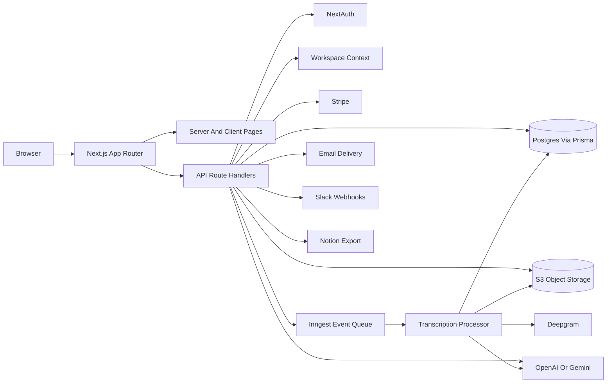
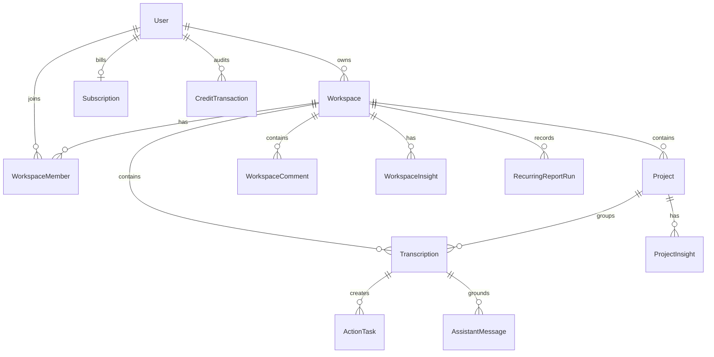
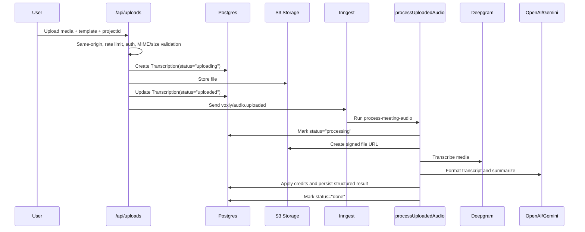
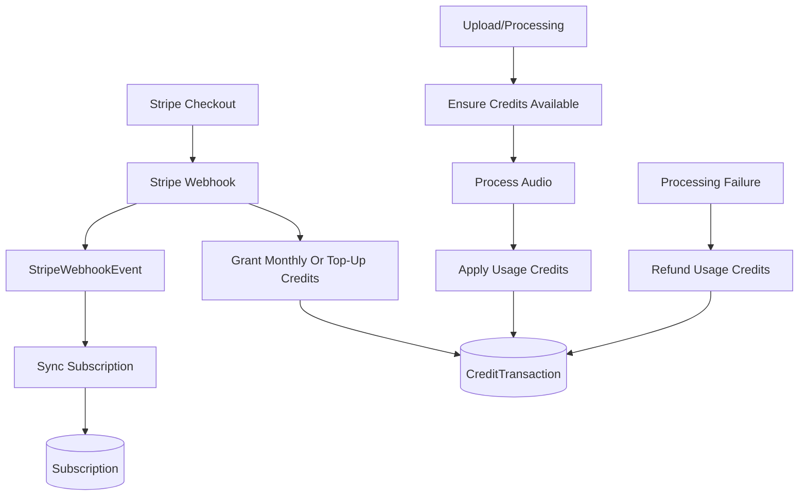

# Voxly Architecture And Workflow

## Purpose

Voxly is a production-oriented transcription workspace. It lets authenticated users upload audio or video, process recordings with Deepgram and LLMs, organize the results into workspaces and projects, ask grounded questions across transcripts, track action items, collaborate through comments and notifications, and deliver recurring reports through email, Slack, and Notion-oriented workflows.

The codebase is intentionally shaped as a full-stack Next.js application. The UI, route handlers, background job entry points, Prisma data model, and deployment assets live together so product features can move quickly while still keeping clear boundaries between presentation, API orchestration, domain logic, persistence, and external integrations.

## Stack

| Layer | Technology | Where |
| --- | --- | --- |
| Web app | Next.js 16 App Router, React 19, Tailwind CSS 4 | `app/`, `app/dashboard/`, `app/session/[id]/` |
| API | Next.js route handlers | `app/api/**/route.ts` |
| Auth | NextAuth credentials provider, Prisma adapter, bcrypt | `lib/auth.ts`, `app/api/auth/**` |
| Database | PostgreSQL through Prisma | `prisma/schema.prisma`, `lib/prisma.ts` |
| Async jobs | Inngest | `inngest/client.ts`, `inngest/functions.ts`, `app/api/inngest/route.ts` |
| Storage | S3-compatible object storage | `lib/storage/s3.js` |
| Speech-to-text | Deepgram | `lib/deepgram.js` |
| LLMs | OpenAI and Gemini behind provider wrappers | `lib/llm/**` |
| Billing | Stripe subscriptions, top-ups, portal, webhooks | `lib/billing.ts`, `app/api/billing/**`, `app/api/stripe/webhook/route.ts` |
| Collaboration | Workspaces, members, invites, comments, notifications | `lib/workspaces.ts`, `lib/workspace-invites.ts`, `lib/comments.ts`, `lib/notifications.ts` |
| Reporting | Workspace/project digests and recurring report run history | `lib/workspace-digests.ts`, `lib/project-digests.ts`, `lib/report-runs.ts` |
| Delivery | Email, Slack, Notion export/share hooks | `lib/email.ts`, `lib/slack.ts`, `lib/notion.ts`, `lib/insight-export.ts` |
| Deployment | Docker, AWS, Terraform, GitHub Actions docs | `Dockerfile`, `terraform/`, `terraform-gcp/`, deployment runbooks |

## High-Level Architecture



## Directory Map

| Path | Responsibility |
| --- | --- |
| `app/page.tsx` | Public landing/home entry point |
| `app/dashboard/**` | Authenticated dashboard surfaces: overview, intelligence, operations, history, settings, upload |
| `app/session/[id]/**` | Single processed recording view, transcript panels, assistant panels, onboarding and next-step UX |
| `app/api/**` | Server-side route handlers for uploads, transcription processing, assistant chat, intelligence, workspaces, billing, comments, notifications, integrations |
| `lib/api/**` | Shared API concerns such as validation, same-origin checks, rate limiting, normalized error responses |
| `lib/transcriptions/**` | Transcript processing helpers and searchable text construction |
| `lib/llm/**` | Provider-specific OpenAI/Gemini calls and provider fallback wrapper |
| `lib/workspaces.ts` | Authenticated workspace resolution, default workspace/project creation, role helpers, resource scoping |
| `lib/billing.ts` | Plans, credit ledger, Stripe customer/subscription sync, webhook idempotency, promo redemption |
| `lib/intelligence/**` | Context chunking and grounded prompts for project/workspace intelligence |
| `lib/workspace-digests.ts`, `lib/project-digests.ts` | Digest settings, schedule calculations, payload construction, delivery orchestration |
| `inngest/**` | Background audio-processing function and Inngest HTTP endpoint |
| `prisma/schema.prisma` | Source of truth for users, workspaces, projects, transcriptions, tasks, comments, notifications, insights, billing, reporting |
| `docs/**` | Product/workflow documentation |
| `terraform/**`, `terraform-gcp/**`, `aws/**` | Infrastructure examples and deployment support |

## Core Domain Model



Important relationships:

- `User` owns authentication identity, personal data, billing, templates, assistant messages, and audit-linked activity.
- `Workspace` is the collaboration boundary. It owns members, invites, projects, transcriptions, comments, notifications, insight records, digest settings, Slack/Notion settings, and report runs.
- `Project` groups recordings inside a workspace and can have project-level insights and project-level digest settings.
- `Transcription` stores uploaded file metadata, processing status, raw/formatted transcript text, structured summary JSON, duration, and search text.
- `ActionTask` turns extracted follow-ups into durable work items with status, priority, assignee, due date, and comments.
- `ProjectInsight` and `WorkspaceInsight` persist grounded intelligence answers with cited transcript sources.
- `Subscription` and `CreditTransaction` separate current credit balance from immutable credit history.
- `StripeWebhookEvent` makes webhook handling idempotent.
- `RecurringReportRun` records every manual or scheduled digest attempt for operational visibility.

## Request Architecture

Most mutating API routes follow the same pattern:

1. Enforce same-origin requests with `enforceSameOrigin`.
2. Apply an in-memory IP rate limit with `enforceRateLimit`.
3. Resolve the authenticated user or full workspace context.
4. Parse request bodies with Zod schemas from `lib/api/validation.ts`.
5. Scope reads and writes to the active workspace using helpers from `lib/workspaces.ts`.
6. Call domain logic in `lib/**`.
7. Return normalized JSON errors through `getApiErrorMessage` and `getApiErrorStatus`.

Example route skeleton:

```ts
export async function POST(request: Request) {
  const originError = enforceSameOrigin(request);
  if (originError) return originError;

  const rateLimitError = enforceRateLimit(request, "feature-key", {
    limit: 30,
    windowMs: 60_000,
  });
  if (rateLimitError) return rateLimitError;

  const context = await requireWorkspaceContext();
  if (!context) {
    return NextResponse.json({ error: "Unauthorized" }, { status: 401 });
  }

  const parsed = someSchema.safeParse(await request.json().catch(() => ({})));
  if (!parsed.success) {
    return NextResponse.json({ error: "Invalid request body" }, { status: 400 });
  }

  // Domain operation scoped to context.activeWorkspace.id.
}
```

## Authentication And Workspace Resolution

Authentication uses NextAuth credentials with bcrypt password comparison. Sign-in is blocked until `emailVerified` is set, which matters because the app can trigger paid transcription and LLM work.

Workspace resolution lives in `lib/workspaces.ts`:

- `requireAuthenticatedUser` loads the current user from the NextAuth session.
- `ensurePersonalWorkspaceForUser` creates or repairs a personal workspace for each user.
- `ensureDefaultProjectForWorkspace` creates a `Default` project for uploads without an explicit project.
- `getWorkspaceContext` reads the `voxly_workspace` cookie, loads active memberships, and returns the active workspace plus role.
- `activeWorkspaceResourceWhere` builds Prisma filters that keep personal workspace compatibility with older user-owned records.

This keeps route handlers from hand-rolling membership checks and gives the project a clear multi-tenant boundary.

## Upload And Processing Workflow



Key details:

- Upload validation is centralized around `MAX_UPLOAD_SIZE_BYTES` and `ALLOWED_UPLOAD_MIME_TYPES`.
- Files are stored outside the database under user-scoped S3 keys.
- The database status sequence is explicit: `uploading`, `uploaded`, `processing`, `done`, or `error`.
- Processing is idempotency-aware: if a completed result already exists for the same template, the worker can reuse it.
- Credits are checked before processing and applied after Deepgram returns duration.
- On processor failure, usage credits are refunded and the transcription is marked `error`.
- The Inngest function sends a session-ready email after a new successful processing run.

## LLM And Intelligence Workflow

LLM calls go through `lib/llm/agent.js`. The wrapper supports OpenAI and Gemini, selects a default provider from `LLM_PROVIDER`, and can fall back between providers unless a provider is explicitly pinned with `openai-only` or `gemini-only`.

Transcript processing uses LLMs for two separate operations:

- `formatTranscript` improves readable transcript formatting while preserving a fallback to Deepgram-readable output.
- `summarizeTranscript` produces structured sections used by the UI, search, assistant chat, and tasks.

Project and workspace intelligence use a lightweight retrieval flow:

1. Load the latest processed transcripts in the selected project or workspace.
2. Combine structured summary strings with transcript chunks.
3. Rank chunks using token matching against the question.
4. Build a prompt that instructs the model to answer only from provided excerpts.
5. Require JSON output containing `answer`, `sourceIds`, and an optional `confidenceNote`.
6. Return cited sources and coverage metadata to the client.

This is not a vector database architecture yet. It is a pragmatic grounded-retrieval layer that works with the existing relational store and can be upgraded later to embeddings if transcript volume demands it.

## Billing And Credit Workflow

Billing is user-level while workspaces are collaboration-level. Current plan state lives in `Subscription`; immutable balance changes live in `CreditTransaction`.



Billing responsibilities in `lib/billing.ts`:

- Environment-backed Stripe price configuration for Starter, Pro, Team, and top-up packs.
- Stripe customer creation and reuse.
- Subscription sync from Stripe subscription objects.
- Monthly credit refresh from paid invoices.
- One-time credit top-up grants from completed checkout sessions.
- Promo code redemption with date windows, redemption caps, new-user restrictions, and request fingerprints.
- Webhook idempotency through `StripeWebhookEvent`.
- Credit consumption rounded by recording duration in whole minutes.

## Workspace, Collaboration, And Operations Workflow

Workspaces provide the operating model for the product:

- Owners/admins manage members, roles, invites, Slack destinations, Notion settings, and digest settings.
- Projects organize transcripts and keep project-specific insights and digests separate.
- Comments can target transcriptions, tasks, project insights, or workspace insights.
- Mentions and digest activity can create in-app notifications and emails depending on user preferences.
- Audit logs record workspace activity such as delivery setting changes, invite/member changes, and report delivery events.

Operational surfaces in the dashboard use `RecurringReportRun` and report summaries to show delivery status, success rates, report types, and recent activity.

## Digest And Delivery Workflow

Workspace and project digests share the same pattern:

1. Load or upsert digest settings.
2. Validate cadence, local hour, timezone, recipient scope, and delivery channels.
3. Build a payload from recent insights, open tasks, recent tasks, transcript counts, and project/workspace metadata.
4. Deliver by email and/or Slack.
5. Create notifications and audit logs.
6. Record a `RecurringReportRun` with delivery metadata.
7. Update `lastSentAt` to prevent duplicate sends within the same scheduled hour.

Current delivery channels:

- Email through `lib/email.ts`.
- Slack incoming webhooks and named workspace Slack destinations.
- Notion settings/export hooks for insight delivery and workspace configuration.

## Security Controls

Implemented controls:

- Email verification before credential login.
- bcrypt password hashing.
- NextAuth session handling.
- Same-origin enforcement on mutating routes.
- IP-based in-memory rate limiting.
- Zod validation for API payloads.
- Upload MIME and 500 MB size limits.
- S3 signed URLs for processor access.
- Stripe webhook signature verification.
- Stripe webhook idempotency table.
- Admin promotion routes gated by admin email configuration.
- Hashed IP and user-agent fingerprints for promo abuse analysis.
- Security headers configured in `next.config.ts`.
- Workspace role helpers and active-workspace Prisma scoping.

Known production hardening opportunities:

- Move rate limiting from in-memory maps to Redis or another distributed store.
- Add formal integration tests around billing, webhooks, uploads, workspace permissions, and report delivery.
- Tighten CSP once all production scripts/styles are known.
- Encrypt sensitive integration secrets stored for Slack and Notion.
- Add structured logging, metrics, and tracing around async processing and delivery jobs.

## Deployment Architecture

The repository includes several deployment paths:

- `Dockerfile` for containerized Next.js builds.
- AWS Elastic Beanstalk packaging through `scripts/package-beanstalk.sh`.
- AWS deployment documentation and GitHub Actions CI/CD notes.
- Terraform examples for AWS and GCP starter infrastructure.
- Prisma binary targets include native and `rhel-openssl-3.0.x`, which supports Linux deployment environments commonly used by AWS.

Operational docs to read with this file:

- `AWS_READINESS_CHECKLIST.md`
- `ELASTIC_BEANSTALK_DEPLOYMENT.md`
- `GITHUB_ACTIONS_CICD.md`
- `MIGRATION_RUNBOOK.md`
- `LAUNCH_RUNBOOK.md`
- `docs/workspace-project-team-workflow.md`
- `docs/workspace-delivery-settings.md`

## Future Architecture Direction

The current architecture is a strong MVP-to-production bridge. The highest-leverage next steps are:

- Add Redis-backed rate limiting and job coordination.
- Move heavy media processing into isolated workers if traffic grows beyond web-app capacity.
- Add embeddings/vector search for large workspace intelligence.
- Add integration tests for critical API flows and webhook replay behavior.
- Add encryption-at-rest helpers for workspace integration credentials.
- Add observability around processor duration, provider fallback rates, billing events, and digest delivery failures.
