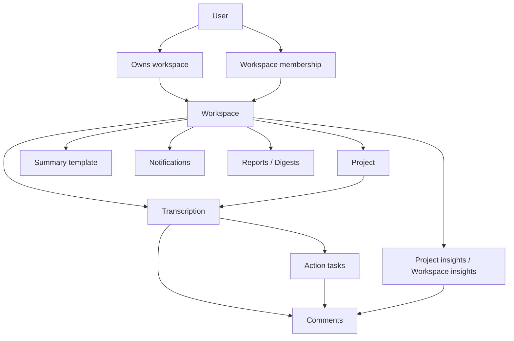

# Voxly Workflow: Workspace, Project, and Team Members

This document explains how Voxly is organized and how the main collaboration objects relate to each other.

## Core Model

At a high level:

- A **workspace** is the top-level collaboration boundary.
- A **project** lives inside a workspace.
- A **team member** joins a workspace, not an individual project.
- A **transcription** belongs to a workspace and can optionally belong to a project.
- **Tasks**, **comments**, **insights**, **notifications**, and **reports** inherit that workspace context.

## Relationship Overview



## What Each Layer Means

### 1. Workspace

A workspace is the main operating container in Voxly.

It controls:

- members and roles
- invites
- billing ownership
- projects
- shared transcriptions
- shared templates
- shared tasks
- shared insights
- integrations like Slack and Notion
- recurring report settings

There are 2 practical workspace types:

- **Personal workspace**
  - created for an individual user
  - still follows the same model, just with one owner by default
- **Shared workspace**
  - used by a team
  - supports invites, roles, comments, notifications, and shared workflows

### 2. Project

A project is an organizational layer inside a workspace.

Use a project to group related recordings, for example:

- one client account
- one interview study
- one hiring loop
- one internal initiative

A project does **not** create its own membership model.
If someone can access the workspace, they can access the project unless future project-level restrictions are added.

### 3. Team Member

Team members belong to the workspace.

Current role model:

- `owner`
- `admin`
- `member`
- `viewer`

In practice:

- **owner** manages the workspace, ownership, and billing relationship
- **admin** manages most workspace operations
- **member** contributes to recordings, tasks, comments, and insights
- **viewer** is read-only

## Practical Hierarchy

If you think in product terms, the structure is:

1. **Workspace**
2. **Projects inside the workspace**
3. **Transcriptions inside the workspace, optionally attached to a project**
4. **Tasks, comments, insights, and reports built from those transcriptions**

Example:

```text
Workspace: Acme Customer Research
  Project: Onboarding Interviews
    Transcription: Interview with Customer A
    Transcription: Interview with Customer B
  Project: Churn Analysis
    Transcription: Exit interview with Customer C
```

The members join the **workspace**, then collaborate across all of the projects and recordings inside it.

## How Data Flows

### Upload Flow

1. A user uploads a recording into the active workspace.
2. Voxly creates a transcription in that workspace.
3. The transcription can be linked to a project.
4. Voxly generates notes, summaries, and action-ready output.
5. Team members in the workspace can review and collaborate on the result.

### Task Flow

1. Voxly extracts action items from a transcription.
2. Users can convert them into managed tasks.
3. Those tasks belong to the same workspace as the transcription.
4. Tasks can then appear:
   - on the transcription itself
   - in workspace-wide task views

### Insight Flow

1. Users ask AI questions at:
   - transcript scope
   - project scope
   - workspace scope
2. Voxly generates grounded answers with citations.
3. Users can save those answers as:
   - **project insights**
   - **workspace insights**
4. Team members can comment on them, mention each other, pin them, archive them, and export/share them.

## Team Collaboration Model

### Members Join the Workspace

Collaboration starts at the workspace layer:

- invite teammate by email
- assign role
- teammate accepts invite
- teammate enters the same shared workspace

Once inside, they can collaborate on:

- recordings
- tasks
- comments
- insights
- notifications
- reports

### Projects Organize Work, Not People

This is the most important relationship to understand:

- **workspace = people boundary**
- **project = work grouping**

That means projects help structure content, but team membership and permissions are still managed at the workspace level.

## Billing Relationship

Voxly currently uses an **owner-credit model**.

That means:

- billing belongs to the workspace owner account
- the workspace consumes the owner’s subscription and credits
- owners/admins can manage billing
- other members may see billing context, but they do not own the billing relationship

So in practice:

- the **workspace** is the collaboration unit
- the **owner account** is the billing source

## Common Scenarios

### Solo user

- One user
- One personal workspace
- Optional projects for organization
- No team invites needed

### Small team

- One shared workspace
- Several members
- Multiple projects
- Shared transcriptions, tasks, and insights
- Recurring reports and integrations managed once at the workspace level

### Agency / multi-client setup

- One workspace for internal collaboration
- One project per client or engagement
- Shared templates and reporting rules at workspace level
- Client work separated by project inside the same workspace

## Rules of Thumb

- Put people into a **workspace**
- Put related recordings into a **project**
- Keep tasks attached to the transcription they came from
- Save insights at the narrowest useful scope:
  - project insight for project-specific knowledge
  - workspace insight for cross-project knowledge

## Recommended Mental Model

Think of Voxly like this:

- **Workspace** = the team room
- **Project** = the folder or initiative inside that room
- **Transcription** = the individual recording/result
- **Task** = the follow-up work item
- **Insight** = reusable knowledge generated from one or more recordings

That mental model matches how the current product is built and how permissions, collaboration, and billing behave today.
