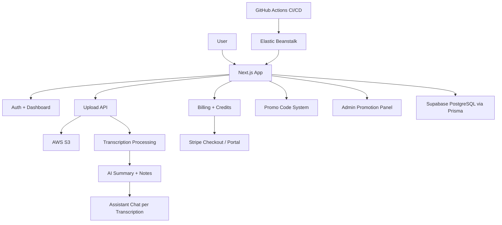

# Voxly

## Short Portfolio Blurb

Voxly is a full-stack AI transcription workspace that turns uploaded audio into transcripts, summaries, action items, and searchable notes. I built the product end to end with authentication, per-transcription AI chat, Stripe billing, promo codes, and AWS deployment using Elastic Beanstalk, S3, Terraform, and GitHub Actions.

## Resume Project Version

**Voxly**  
Built a production-style AI transcription SaaS using Next.js, TypeScript, Prisma, and PostgreSQL/Supabase, enabling users to upload audio, generate transcripts, extract structured notes, and interact with a per-transcription AI assistant. Implemented Stripe-based subscriptions and credit top-ups, promo-code redemption with abuse controls, email verification, admin tooling, and AWS deployment infrastructure with Elastic Beanstalk, S3, Terraform, Cloudflare, and GitHub Actions CI/CD.

## 1-Line Resume Bullet

Built **Voxly**, a full-stack AI transcription SaaS with audio upload, transcript summarization, per-recording AI chat, Stripe billing, promo-code controls, and AWS deployment using Elastic Beanstalk, S3, Terraform, Cloudflare, and GitHub Actions.

## LinkedIn Project Description

Voxly is a production-style AI transcription platform I built end to end using Next.js, TypeScript, Prisma, and PostgreSQL/Supabase. The app lets users upload audio, generate transcripts, extract structured notes and action items, and chat with an AI assistant tied to each transcription. I also implemented Stripe subscriptions and credit top-ups, promo-code and abuse-control systems, email verification, admin tools, and cloud deployment on AWS with Elastic Beanstalk, S3, Terraform, Cloudflare, and GitHub Actions CI/CD.

## Capstone Presentation Slide Version

- Full-stack SaaS for audio upload, transcription, summaries, and action items
- Per-transcription AI assistant with stored chat history
- Credit-based billing with Stripe subscriptions, top-ups, and promo codes
- Production-focused architecture using Next.js, Prisma, Supabase, AWS, Terraform, and GitHub Actions

## Project Description

**Voxly** is a full-stack AI transcription workspace that turns uploaded audio into structured, actionable notes. Users can upload recordings, generate transcripts, extract key points and action items, chat with an AI assistant per transcription, manage credits and subscriptions through Stripe, and redeem time-limited promo codes. The platform is designed to feel production-ready, with authenticated workflows, background processing, billing controls, email verification, admin promo management, and cloud deployment on AWS Elastic Beanstalk with S3 storage and Cloudflare DNS.

I built Voxly as an end-to-end SaaS-style product, not just a demo UI. The project includes real user authentication, file upload handling, transcription processing, AI summarization, assistant chat history stored per recording, Stripe billing and top-ups, promo code restrictions, and deployment infrastructure with Terraform and CI/CD. I also focused heavily on product UX, refining the dashboard workflow so users can move naturally from choosing a file to processing it and interacting with refreshed AI notes.

## Highlights

- Full-stack Next.js app with authenticated user accounts
- Audio upload and transcription workflow with structured AI summaries
- Per-transcription AI assistant chat history
- Credit-based billing model with Stripe checkout and customer portal
- Promo code system with expiration, one-time redemption, and abuse controls
- Email verification and admin promo management
- AWS deployment with Elastic Beanstalk, S3, Terraform, and GitHub Actions CI/CD
- Cloudflare-based domain and HTTPS setup

## Tech Stack

- `Next.js`
- `TypeScript`
- `Prisma`
- `PostgreSQL / Supabase`
- `Stripe`
- `AWS S3`
- `AWS Elastic Beanstalk`
- `Terraform`
- `GitHub Actions`
- `Cloudflare`

## Architecture

